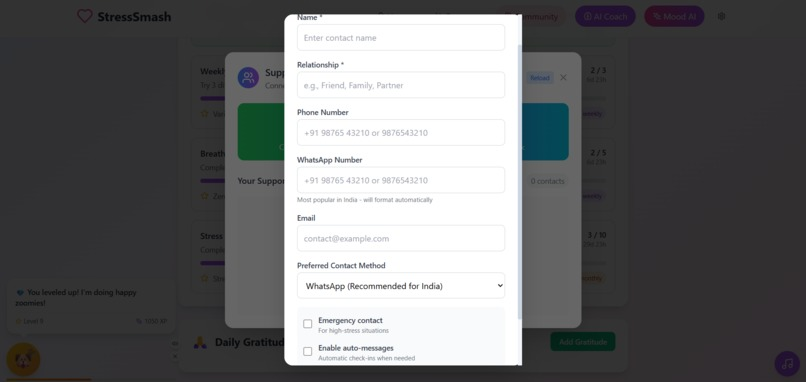

# MoodBoost 🌟

A modern, interactive mood-adaptive stress relief application built with React, TypeScript, and Vite. MoodBoost helps users manage stress and improve mental wellness through personalized games, AI-powered coaching, and social connections.



## ✨ Features

### 🎮 Interactive Wellness Games (18 Games)
- **Anger Management**: Smash Game, Stress Squeeze Ball
- **Breathing & Meditation**: Breathing Exercises, Meditation Garden, Zen Garden
- **Creative Expression**: Drawing Pad, Color Therapy, Dance Therapy
- **Fun & Joy**: Bubble Pop, Joy Burst, Energy Bounce, Smile Mirror
- **Mindfulness**: Mindful Maze, Rhythm Tap, Word Flow
- **Social Wellness**: Virtual Hug, Kindness Cards, Gratitude Tree

### 🤖 AI-Powered Features
- **Mood Detection**: Real-time emotion analysis
- **AI Wellness Coach**: Personalized recommendations and support
- **Adaptive Games**: Content adjusts based on current mood and stress levels

### 🎵 Audio Experience
- **Built-in Audio**: Generated nature sounds, meditation bells, ambient music
- **Custom Audio**: Upload your own relaxing tracks
- **Smart Controls**: Volume, looping, and auto-play settings

### 📱 Social Connection
- **Support Network**: Add trusted contacts for emergency situations
- **Auto-messaging**: Automatic check-ins when stress levels are high
- **Progress Sharing**: Celebrate achievements with friends and family
- **Multiple Contact Methods**: WhatsApp, Phone, SMS, Email

### 📊 Progress Tracking
- **Detailed Analytics**: Session history, mood trends, stress patterns
- **Achievement System**: Unlock rewards for consistent practice
- **Daily Streaks**: Build healthy habits with streak tracking
- **Privacy Controls**: Full control over your data

### 🔒 Privacy & Security
- **Local Storage**: All data stays on your device
- **Data Export**: Download your progress anytime
- **Privacy Settings**: Granular control over data sharing
- **Secure**: No personal data sent to external servers

## 🚀 Quick Start

### Prerequisites
- Node.js (v16 or higher)
- npm or yarn

### Installation

1. **Clone the repository**
   ```bash
   git clone https://github.com/DevAgnihotri/MoodBoost.git
   cd MoodBoost
   ```

2. **Install dependencies**
   ```bash
   npm install
   ```

3. **Start development server**
   ```bash
   npm run dev
   ```

4. **Open in browser**
   ```
   http://localhost:5173
   ```

### Build for Production
```bash
npm run build
npm run preview
```

## 🛠️ Technology Stack

- **Frontend**: React 18 + TypeScript
- **Build Tool**: Vite
- **Styling**: Tailwind CSS
- **Animations**: Framer Motion
- **Audio**: Web Audio API
- **AI Integration**: Hugging Face Inference API
- **Icons**: Lucide React
- **Sound Effects**: Custom Web Audio implementation

## 📂 Project Structure

```
src/
├── components/           # React components
│   ├── games/           # Wellness game components
│   ├── AudioControls.tsx
│   ├── SocialConnection.tsx
│   └── ...
├── hooks/               # Custom React hooks
├── data/                # Static data and configurations
├── types/               # TypeScript type definitions
└── main.tsx            # Application entry point
```

## 🎯 Key Components

### Game System
- 18 interactive wellness games
- Mood-adaptive difficulty and content
- Progress tracking and achievements
- Sound effects and visual feedback

### AI Integration
- Real-time mood analysis
- Personalized wellness recommendations
- Adaptive content based on user patterns
- Privacy-focused local processing

### Social Features
- Emergency contact system
- Auto-messaging for high stress situations
- Progress sharing capabilities
- Community support features

## 🤝 Contributing

We welcome contributions! Please feel free to submit issues, feature requests, or pull requests.

1. Fork the repository
2. Create your feature branch (`git checkout -b feature/AmazingFeature`)
3. Commit your changes (`git commit -m 'Add some AmazingFeature'`)
4. Push to the branch (`git push origin feature/AmazingFeature`)
5. Open a Pull Request

## 📜 License

This project is licensed under the MIT License - see the [LICENSE](LICENSE) file for details.

## 🙏 Acknowledgments

- Built for mental health awareness and support
- Inspired by evidence-based wellness practices
- Designed with accessibility and inclusivity in mind
- Created with ❤️ for the developer community

## 📞 Support

If you need help or have questions:
- 📧 Open an issue on GitHub
- 💬 Join our community discussions
- 🐛 Report bugs through GitHub issues

---

**MoodBoost** - Your personal wellness companion for a healthier, happier mind. 🧠💙

*Made with ❤️ by [DevAgnihotri](https://github.com/DevAgnihotri)*
